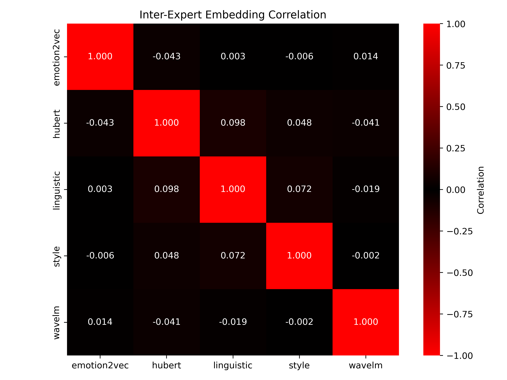
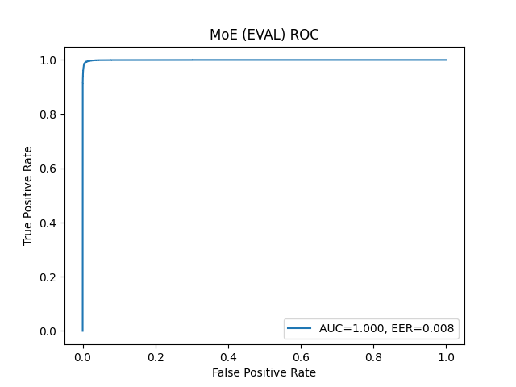

# Deepfake Speech Detection — Mixture of Experts (Experimental)

## What is a Mixture of Experts?

A Mixture of Experts (MoE) is an ensemble approach where multiple specialized models ("experts") each produce a prediction, and a **gate** decides how much to trust each one. Rather than training one large model to handle everything, MoE lets each expert specialize in a different aspect of the problem. For a given input, the gate learns to weight the experts dynamically. e.g., "for this sample, trust the prosody expert more than the linguistic one."

In this project, each expert is a frozen pretrained speech encoder. None of them are trained end-to-end; only the lightweight classifier heads and the gate are trained. This keeps compute requirements low while leveraging rich pretrained representations.

---

## The Experts

Five frozen pretrained models, each encoding a different dimension of speech:

| Expert | Model | What it captures |
|---|---|---|
| **Style** | `ehcalabres/wav2vec2-lg-xlsr-en-speech-emotion-recognition` | Prosody and speaking style, hidden layers 1–12, which encode low-to-mid-level style patterns |
| **Linguistic** | `jonatasgrosman/wav2vec2-large-xlsr-53-english` | Phonetic and linguistic content, layers 15–23, which encode high-level language structure |
| **HuBERT** | `facebook/hubert-large-ls960-ft` | Robust general acoustic representations across all hidden layers |
| **WaveLM** | `microsoft/wavlm-base-plus` | Multi-level speech features across all hidden layers, trained with denoising objectives |
| **Emotion2Vec** | `emotion2vec/emotion2vec_base` | Emotion-focused embeddings extracted via FunASR's generate() interface |

Three optional **dependency experts** extend the above by passing encoder output through a trained `CompressionModule`:
- `StyleDependencyExpert` — compressed style representation
- `LinguisticDependencyExpert` — compressed linguistic representation
- `StyleLinguisticDependencyExpert` — concatenation of both compressed vectors

---

## Architecture

### Step 1 — Embedding extraction

All encoders are frozen. Audio is passed through each encoder once and the resulting embeddings are saved to disk as `.npy` files. This is a one-time offline step.

### Step 2 — Per-expert classifier heads

Each expert's cached embeddings are z-score normalized and fed into a small binary classifier head. Three head types are available:

- **LinearHead** — shallow MLP: 1024 → 256 → 32 → 1
- **ResidualMLPHead** — LayerNorm + GELU + Dropout with a residual skip: 1024 → 512 → 128 → 1
- **CosineMarginHead** — cosine similarity classifier with additive margin (`logit = s * (cos(x,w) - m)`), good for imbalanced data

Loss: `BCEWithLogitsLoss` with positive class weighting to handle the real-vs-spoof class imbalance. Early stopping on EER on the dev set.

### Step 3 — Fusion

Once each expert has a trained head, its output is a single real-valued **logit** per sample. These logits are then fused across experts. See the section below.

---

## Fusion Methods

Given logits from E experts stacked into a matrix `M` of shape `[N, E]`, the following fusion strategies are available:

### Simple (non-learned) fusions — `evaluate_simple_fusion.py`

These require no additional training and run directly on cached expert logits:

| Method | Formula | Behavior |
|---|---|---|
| **Mean** | `M.mean(axis=1)` | Treats all experts equally; stable but can be dragged by a weak expert |
| **Max** | `M.max(axis=1)` | Takes the most confident (highest) logit; aggressive, sensitive to outlier experts |
| **Min** | `M.min(axis=1)` | Takes the least confident logit; conservative, useful if any one expert flagging is enough |
| **Median** | `np.median(M, axis=1)` | Robust to outlier experts; a good middle ground between mean and min/max |

Each expert can also be evaluated **alone** (`{expert}_alone`) for ablation.

### Learned fusion — `train_moe_gate.py`

**`LateFusionBinaryMoE`** trains a gate network on top of expert logits:

```
expert logits [B, E]
       │
  FC → ReLU → FC
       │
  softmax → gate weights [B, E]    (per-sample, dynamic)
       │
  weighted sum of temperature-scaled logits
       │
  fused logit [B, 1]
```

Key design choices:
- **Learned temperature** (`log_temperature` parameter): scales each expert's logit before weighting, learned during training
- **Per-expert bias**: an additive offset per expert, also learned
- **Entropy regularization** (optional): penalizes the gate for collapsing all weight onto one expert, encouraging diverse usage
- **Gate input**: by default uses the expert logits themselves as gate input, but can optionally take raw embeddings as `gate_features`

### Feature-level fusion — `combined_experts_classifier.py`

An alternative approach: concatenate all expert embeddings into one large vector and train a single classifier on the joint representation. This is an early fusion baseline (vs. the late fusion of MoE).

---

## Results

### Expert Independence

A key justification for using MoE is that the experts should capture *different* information. The inter-expert embedding correlation matrix (measured on ASVspoof2019 eval) confirms this, all off-diagonal correlations are near zero (max 0.098 between HuBERT and Linguistic), meaning each encoder is encoding a genuinely distinct view of the audio.



### ASVspoof2019 — In-domain Performance

Evaluated on ASVspoof2019 LA eval split. All methods were trained on ASVspoof2019 train/dev.

| Method | EER (%) | AUC | F1 | Precision | Recall |
|---|---|---|---|---|---|
| Style | 1.10 | 0.999 | 0.965 | 0.950 | 0.981 |
| Linguistic | 4.10 | 0.993 | 0.865 | 0.814 | 0.923 |
| HuBERT | 2.07 | 0.998 | 0.940 | 0.958 | 0.923 |
| WaveLM | 1.96 | 0.998 | 0.938 | 0.961 | 0.916 |
| **Mean fusion** | **0.60** | **1.000** | **0.984** | 0.990 | 0.978 |
| Median fusion | 0.68 | 1.000 | 0.980 | 0.987 | 0.973 |
| MoE (learned gate) | 0.80 | 1.000 | 0.975 | 0.967 | 0.984 |
| Max fusion | 1.38 | 0.999 | 0.869 | 0.770 | 0.997 |



Mean and median fusion slightly outperform the learned MoE gate on this benchmark, likely because ASVspoof2019 is a controlled dataset where equal weighting is already near-optimal. Max fusion has high recall but low precision (many false alarms).

### Cross-dataset Generalization

Performance degrades significantly on out-of-domain data, revealing the challenge of real-world deepfake detection:

| Method | ASVspoof2019 EER (%) | ITW EER (%) | FamousFigures EER (%) |
|---|---|---|---|
| Mean fusion | 1.75 | 37.14 | 54.23 |
| Max fusion | 3.01 | 30.33 | 55.13 |
| Min fusion | 4.18 | 46.56 | 43.24 |
| Median fusion | 2.42 | 34.26 | 57.54 |
| HuBERT alone | 3.52 | **25.01** | 71.46 |
| Style alone | 5.72 | 29.12 | 51.25 |
| Emotion2Vec alone | 9.02 | 32.57 | **48.93** |
| style_linguistic_dep | 4.15 | 45.87 | **37.40** |
| Feature concat (fused classifier) | 2.08 | 19.56 | 68.11 |

Key observations:
- **ITW**: HuBERT alone (25.01% EER) outperforms all fusion methods. The feature-level concat classifier (19.56%) is the best overall on ITW.
- **FamousFigures (Donald Trump)**: All methods struggle badly, most exceed 50% EER (worse than chance). The `style_linguistic_dependency` combination (37.40%) and Emotion2Vec (48.93%) are relatively best. This reflects a severe domain mismatch: models trained on ASVspoof2019 spoofing artifacts do not generalize to this speaker-specific deepfake distribution.
- Fusion methods that work well on ASVspoof2019 (mean, median) do not necessarily generalize; sometimes a single well-matched expert is stronger on out-of-domain data.

---

## How to Use

**1. Extract embeddings** (one-time, run on GPU)
```bash
python extract_all_experts.py
# or on SLURM:
sbatch extract_all_experts.sbatch
```

**2. Train per-expert classifiers**
```bash
python train_expert_classifier.py
# or:
sbatch train_classifier.sbatch
```

**3. Train the MoE gate**
```bash
python train_moe_gate.py
```

**4. Evaluate simple fusions** (mean / max / min / median)
```bash
python evaluate_simple_fusion.py
```

Results (EER, AUC, F1, etc.) are written to `results/`. Score files (CSV + TXT) per expert and per fusion method go to `results/scores/`. Plots go to `plots/`.

Configure dataset paths and cache location at the top of each script.
